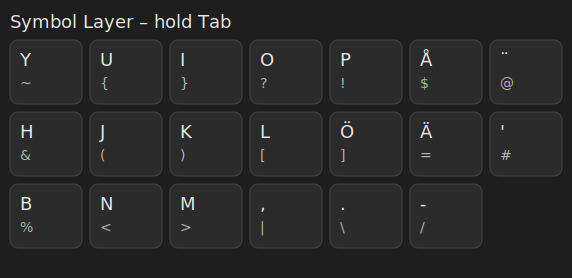
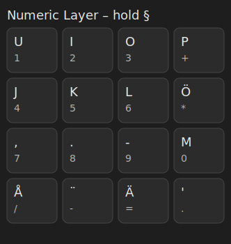

# Keymap Reference (ISO Nordic, Coding-First)

This document summarizes the layers. 

> **Legend**: Base=normal typing. L1=Symbol (hold **Tab**). L2=Numeric (hold **§**). L3=Media. L4=Vanilla.

## Overview
- **L0 Base**
  - **Tab** = tap: Tab, **hold**: **Symbol layer (L1)** via `LT(1, KC_TAB)`
  - **§** (left of `1`) = tap: §, **hold**: **Numeric layer (L2)** via `LT(2, KC_GRV)`
  - **CapsLock** = Esc

- **L3 Media / Utility**
  - **Esc**: toggle RGB matrix (`RM_TOGG`)
  - **1**: `DF(0)` — switch to your mapped setup as default
  - **2**: `DF(4)` — switch to **Vanilla** (clean) as default

- **L4 Vanilla**
  - Plain Tab, § back to Grave, CapsLock behaves normally.
  - No custom layer-taps or toggles

## Graphics Cheatsheets
Below are simple SVG cheatsheets for **Symbol** and **Numeric** layers.

### Symbol Layer (hold **Tab**)

### Numeric Layer (hold **§**)

